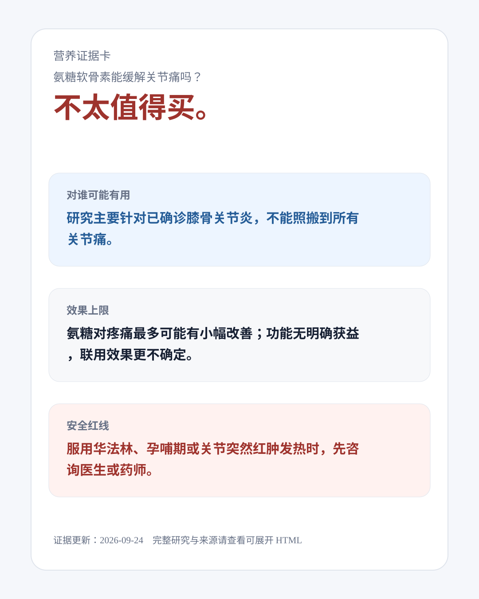

# 先看证据，再决定要不要补

**Evidence-Based Nutrition Advisor** 是一个可安装到 AI Agent 的营养证据 Skill。问它“鱼油有用吗？”“这款氨糖值得买吗？”，它会先给你容易理解的判断，再说明证据适用于谁、效果可能有多大、有什么安全问题，以及哪些信息仍可能改变结论。



[打开完整的可展开证据卡](https://buuaaa.github.io/evidence-based-nutrition-advisor/examples/cases/glucosamine-2026-quick/answer.html) · [查看本次来源核验记录](examples/cases/glucosamine-2026-quick/source-notes.md)

> 这张卡由新版 Skill 于 **2026-09-24** 针对一般证据问题生成。它是快速核验示例，没有使用个人健康资料，也没有声称完成全量文献审计或正式 EAL 评级。

## 它能帮你做什么

- **先回答决策问题。**把“有论文支持”拆成：适用于谁、实际效果有多大、是否值得为此花钱、何时需要先就医。
- **核对来源，而不是按发表年份排队。**结合与你所在地区相关的标准或临床建议、经过方法检查的指南或综述，以及权威安全资料；指出研究质量、剂型和适用人群的差异。
- **只追问会改变答案的信息。**一般知识问题直接回答；个人购买或使用决策才询问诊断、剂量、关键用药等必要信息。你可以说“不清楚”或先跳过。
- **把不确定性留在台面上。**快速卡会写明核验日期、来源、覆盖范围和未解答的问题；不会把尚未完成的评价包装成确定等级。
- **需要时再深入。**你明确要求后，Skill 可展开 PubMed 检索、题录筛查、资料可得性记录和按结局的证据评价；具备合并条件时才考虑 Meta 分析。

## 看一个真实问题

**“补充氨糖软骨素能缓解关节疼痛吗？”**

新版快速核验给出的回答是：**对病因不明的关节痛，不太值得盲买。**研究主要针对已确诊的膝骨关节炎；氨糖对疼痛最多可能有小幅改善，功能改善并不明确，复方产品更难直接套用单成分研究。使用华法林或出现突然红肿热痛时，安全处置应先于购买判断。

这次核验发现：中国膝骨关节炎专家共识称症状获益仍不确定；[美国风湿病学会 2026 年指南摘要](https://assets.contentstack.io/v3/assets/bltee37abb6b278ab2c/bltb3d12c34020da842/oa-guideline-summary-2026.pdf)给出不推荐意见；一篇 [2026 年伞状综述](https://www.frontiersin.org/journals/nutrition/articles/10.3389/fnut.2026.1806413/full)观察到很小的疼痛信号，但它纳入的综述多数方法学质量低或极低。卡片将这些差异、[安全资料](https://www.nccih.nih.gov/health/glucosamine-and-chondroitin-for-osteoarthritis-what-you-need-to-know)和未完成的审计步骤分别展示。[查看来源与判断过程](examples/cases/glucosamine-2026-quick/source-notes.md)。

## 开始使用

将仓库放进宿主 Agent 的 Skills 目录。以 Windows 上的 Codex 用户目录为例：

```powershell
$skillRoot = Join-Path $env:USERPROFILE '.codex\skills'
New-Item -ItemType Directory -Force -Path $skillRoot | Out-Null
git clone https://github.com/BuuaaA/evidence-based-nutrition-advisor.git `
  (Join-Path $skillRoot 'evidence-based-nutrition-advisor')
```

在新会话中试试：

```text
使用 $evidence-based-nutrition-advisor：鱼油能改善甘油三酯吗？
请先给快速判断，告诉我适用人群、效果上限、安全注意事项和依据。
```

若你准备为自己购买某款产品，可以提供成分表、剂量和目标；涉及用药或疾病时，只补充愿意提供且会影响判断的信息。Skill 的详细输出是一张可展开的本地 HTML 证据卡。

| 你要做的事 | Skill 会交付什么 |
|---|---|
| 快速了解一种营养干预 | 先给判断与安全边界，列出已核验来源和未确定之处 |
| 核实个人产品选择 | 追问少量关键条件，再比较产品、研究人群与剂型是否匹配 |
| 要求完整证据审计 | 保存检索与筛查轨迹，按结局解释研究质量、效果和缺口 |
| 研究级证据合成 | 在方案和数据满足条件时提取研究并分析；不适合合并时给结构化综合 |

本项目提供证据检索与决策支持，不能诊断疾病或替代医生、药师和注册营养专业人员。EAL/QCC 是完整审计的组织与评价方法，不代表 Academy of Nutrition and Dietetics 对本项目作出认证；资料或方法不足时，Skill 会保留未评级状态。运行效果取决于宿主 Agent 和当次可用的检索工具。

想了解具体流程，可读 [SKILL.md](SKILL.md) 和 [使用指南](docs/USER_GUIDE.md)。贡献、隐私与安全说明分别见 [CONTRIBUTING.md](CONTRIBUTING.md)、[HEALTH_AND_PRIVACY.md](HEALTH_AND_PRIVACY.md) 和 [SECURITY.md](SECURITY.md)。项目采用 [MIT License](LICENSE)。
