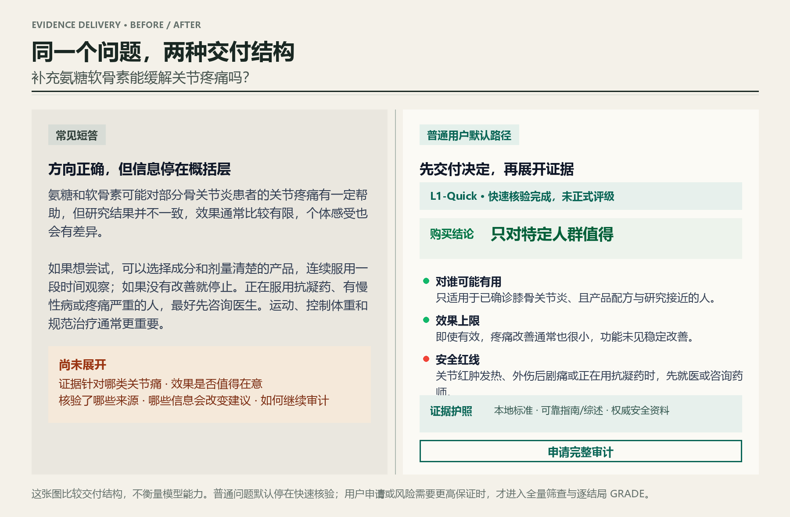

# evidence-based-nutrition-advisor V1.0.1

网上随手就能找到“有论文证明”的营养建议。论文可能互相矛盾，研究对象也常常不同；统计学差异未必达到实际可感知的程度，产品宣传还会把有限结论讲得过满。

evidence-based-nutrition-advisor V1.0.1 是一个开放的 Agent Skill。它先界定问题，目标是在 90 秒内生成一张标明核验层级的个性化 HTML 证据卡。用户申请完整审计，或风险需要更高保证时，同一张卡再加入可复现的 PubMed 检索、全量题录筛查和逐结局确定性评价。

`普通问题 → L1-Quick 快速核验 → 申请或风险升级 → L1-Audited 完整审计 → 需要重新合并研究时进入 L2-Research`

它处理的是几个更实际的问题：

- 证据到底适用于谁；
- 效果有多大，是否达到值得在意的程度；
- 为什么指南、综述、单项试验和产品宣传会得出不同结论；
- 哪些信息会改变现在的建议；
- 证据不完整时，结论究竟有多不稳。

> [!IMPORTANT]
> 本项目用于证据检索、审计和决策支持，不用于诊断或替代治疗。孕哺、未成年人、肝肾疾病、处方药、手术、明显异常化验或进行性症状，应优先咨询医生、药师或注册营养专业人员。

## 三种任务

路径由任务决定，与用户的职业头衔无关。普通用户可以申请完整审计，专业人员也可以只要一张快速购买卡。

| 任务 | 什么时候使用 | 交付结果 |
|---|---|---|
| 快速判断（L1-Quick） | “补充氨糖软骨素能缓解关节疼痛吗？”“这个产品值不值得买？” | 先查已审计缓存；未命中时核验本地标准、可靠指南或综述、权威安全资料，生成一张明确标注“快速核验，未正式评级”的 HTML 证据卡。卡片提供“申请完整审计”按钮。 |
| 完整证据审计（L1-Audited） | 用户明确要求专业或完整审计，或当前风险需要更高保证 | 历史证据基座、可复现的 PubMed 更新检索、限定范围内的全部题录筛查、全文边界、PICOS 纳排，以及逐关键结局的效应和确定性。 |
| 研究级合成（L2-Research） | 需要重新提取原始研究、重新合并数据或形成研究方案 | 预先指定数据库和方案，完整导出与筛查，提取可核查全文，完成偏倚评价、统计合并、敏感性分析、GRADE 和复现记录。 |

可直接查看：

- [普通用户 L1-Quick 证据卡（含“申请完整审计”按钮）](examples/consumer-answer-quick-demo.html)
- [14 个行为验收用例](https://buuaaa.github.io/evidence-based-nutrition-advisor/examples/consumer-answer-demo.html)
- [氨糖软骨素完整审计示例](examples/cases/glucosamine-chondroitin/answer.html)
- [专业证据展示：老年人补钙](examples/cases/calcium-older-adults/professional-evidence.md)
- [单数据库 Meta 证据合成示例](examples/cases/meta-routing/original-meta-result.md)

## 一张图看懂交付差异



左侧保留常见的概括式回答。右侧展示当前普通用户路径：先给决定和适用边界，再显示 L1-Quick 的三类核验来源，并提供“申请完整审计”按钮。普通提问不会自动触发 PubMed 全量筛查或 GRADE；这些步骤在用户申请完整审计或风险需要更高保证时启动。[查看对比图的生成口径](examples/glucosamine-chondroitin-before-after.md)。

## 方法底线

普通功效问题默认执行以下流程：

1. 先判断是在问一般证据，还是准备为自己作决定。一般证据问题直接检索；个人决策或意图不明时，先用点击选项确认通常 3–5 项、至多 5 项真正可能改变建议的信息，不要求填写完整病史，也不为凑数询问无关资料。
2. 先查已审计本地证据包；命中时直接生成缓存审计卡，不重复联网。
3. 未命中时先核验本地标准、可靠指南/综述和权威安全资料，生成 L1-Quick 卡；它不声称系统综述或正式 GRADE。
4. 用户明确要求完整审计或风险需要更高保证时，再保存 PubMed 检索式与 Query Translation，完整导出并筛查全部命中。
5. 完整审计才按关键结局评价 GRADE；若改判，在同一张卡显示改判原因。
6. 始终把证据确定性、当前用户匹配度和最终决策分开表达。

进入完整审计后，历史系统综述用于建立证据基座，PubMed 更新检索负责核查其截止日期之后的新记录。L1-Quick 首卡不等待这套流程。多数据库、注册平台、灰色文献和双人流程属于发表级系统综述的要求；本 Skill 的单数据库 Meta 证据合成只对预先声明的数据库和可得全文负责。

### 为什么先点几项再生成证据

“血脂”“关节痛”“老年人补钙”背后可能对应不同的异常分项、诊断、剂型、关键用药和风险状态，这些信息会直接改变检索人群与建议。Skill 会先做“决策翻转测试”，只保留会改变 PICOS、安全边界或购买判定的问题。

- 宿主支持选择卡或表单时，直接使用原生点击控件；
- 本地环境可运行脚本时，可用一次性 localhost 问卷收集选择，答案只写入临时文件；
- 两者都不可用时，一次只问一个自然语言问题；绝不要求用户回复 1A/2B 等机器代码；
- 每题都有“不清楚”，也可一键跳过并先看一般结论。

本地问卷支持单选、多选、可跳过题和提交前摘要；最终提交会自动写回临时 JSON，用户不必复制答案。这不是完整健康问卷。通常 3–5 项，硬上限 5 项；若只有 1–2 项真正会改变建议，就只问 1–2 项。“适不适合我”展开层用于回顾已采用的信息和剩余不确定性，不再把首次关键问题藏在里面。

### 全文拿不到时怎么处理

全文获取不完整不等于研究结果阴性，也不等于论文质量差。如果 PubMed 命中已完整导出、题名摘要已全部筛查，而且历史证据基座足以界定证据体，Skill 会继续给出逐结局的**暂定 GRADE**，但必须：

- 把等级写成“暂定高 / 暂定中 / 暂定低 / 暂定极低”；
- 显示尚未取得全文的篇数和记录；
- 说明哪些 GRADE 域可能受影响；
- 在结果打开时提示用户上传全文，上传后重新筛选、提取和评级。

如果连检索边界或关键效应都无法识别，则只做 GRADE-informed 判断，不使用四级等级。检索被截断或筛查未完成时，生成器会拒绝输出通常的功效结论。

## 单数据库 Meta 证据合成

这项功能主要面对目前**没有可靠综合结论**的问题，例如：没有系统综述、现有 Meta 已明显过时、纳排或统计方法存在严重缺陷，或者出现了可能改变旧结论的新研究。它用 Meta 分析方法重新合成边界清楚的证据集，交付范围始终限定在预先指定的数据库和可获得全文：

1. 预先确定 PICOS、主要结局、检索截止日期和分析方案；
2. 根据问题和访问条件指定一个数据库，保存完整检索式并导出全部命中；
3. 按预设标准完成题名摘要和全文筛选；
4. 只从能够取得全文、数据可核查的研究中提取效应数据；
5. 评价偏倚风险，判断研究是否适合合并；
6. 完成统计合并、异质性与敏感性分析，并按结局评价 GRADE；
7. 明确列出未取得全文、无法提取或不适合合并的研究。

结果应命名为“基于【数据库名称】和可获得全文的 Meta 证据合成”，只代表该数据库中已识别且能够核查全文的研究。单数据库可能漏掉其他数据库和未发表研究，因此不能写成“全面系统综述”或“发表级 Meta”。它的价值是，在证据结论空白或不可靠时，提供一个范围透明、可以复核、比随机挑选论文更可信的当前估计。

## 安装

请保留整个仓库。`references/`、`scripts/` 和 `templates/` 都是 Skill 的一部分，只复制 `SKILL.md` 会丢失关键能力。

### 让 AI 直接安装

把仓库地址复制给支持 Skills 的 AI：

```text
请从 https://github.com/BuuaaA/evidence-based-nutrition-advisor 安装这个 Skill。
请保留完整目录，并确认最终目录的根部可以直接看到 SKILL.md。
```

### 按宿主的官方文档安装

- Codex：[OpenAI Skills](https://github.com/openai/skills)
- Claude Code：[Agent Skills](https://code.claude.com/docs/en/skills)
- WorkBuddy：[技能说明](https://cloud.tencent.com/document/product/1831/134432)
- TraeWork：[Skills 文档](https://docs.trae.cn/work_skills)

一般做法是把完整仓库放进宿主的用户级或项目级 Skills 目录。不同产品的目录和启用方式可能变化，请以对应官方文档为准。

### 下载 ZIP

在 GitHub 点击 **Code → Download ZIP**，解压后把整个 `evidence-based-nutrition-advisor` 文件夹放入宿主的 Skills 目录；如果宿主支持上传 Skill ZIP，也可直接上传。安装后开启新任务，必要时重启宿主。

## 怎么提问

快速判断：

```text
使用 $evidence-based-nutrition-advisor：吃鱼油能改善血脂吗？
如果这是个人决策且关键信息会改变建议，请先让我点击选择最关键的 3 至 5 项；至多 5 项，不要为凑数提问。收到选择后再生成证据。
```

完整证据审计：

```text
使用 $evidence-based-nutrition-advisor 做专业证据审计：
比较近期指南与系统综述对维生素 D 预防跌倒的结论，给出 PICOS、效应量、GRADE 五域和冲突原因。
```

研究级合成：

```text
使用 $evidence-based-nutrition-advisor，基于 PubMed 和可获得全文，
重新合并某干预对某结局的研究。请先形成 PICOS、主要结局、截止日期和分析方案；
结果不要称为发表级系统综述，并列出无法获取全文或无法提取数据的研究。
```

## 示例与验收

仓库内置 14 个行为验收用例，覆盖模糊提问、产品审计、全文缺失、检索截断、Meta 意图分流、图文一致性、结构化个体试用、安全拦截、单病例随机交叉试验命名边界和完整产品事实采用。每个用例都有 PNG 与 SVG 结果图，并统一收在[可视化示例页](https://buuaaa.github.io/evidence-based-nutrition-advisor/examples/consumer-answer-demo.html)。商品名案例只出现在案例页，不作为首页代表问题。

[L1-Quick 证据卡](examples/consumer-answer-quick-demo.html)由结构化答案和三类核验来源生成，不需要 PubMed manifest、RIS 或筛选日志，并会展示“申请完整审计”按钮。完整审计示例再由结构化答案、PubMed search manifest、原始 RIS 和逐条筛选 CSV 共同生成；生成器会核对检索式、Query Translation、命中数、筛选数、RIS 散列和全文缺失记录，任一项不一致都会拒绝生成。

## 开发与验证

```powershell
python -m unittest discover -s tests -p "test_*.py"
python scripts/build_behavior_case_gallery.py
python scripts/build_before_after_image.py
```

如本机安装了 Codex 的 Skill 校验器：

```powershell
python "$env:USERPROFILE\.codex\skills\.system\skill-creator\scripts\quick_validate.py" .
```

主要目录：

```text
SKILL.md       Skill 入口和模式路由
references/    检索、证据评价、GRADE、研究合成与隐私规则
scripts/       PubMed 检索、HTML 生成、去重和 Meta 工具
templates/     证据卡、筛选日志、提取表和报告模板
examples/      三类任务路径、快速证据卡与可复现审计包
tests/         行为用例、单元测试和统计引擎校验
```

## 安全、贡献与许可

不要把病历、健康档案、Cookie、API 密钥、数据库凭据或下载令牌提交到仓库。健康档案只有在用户明确要求时才建立，并须保存在 Skill 和 Git 仓库之外。更多边界见 [HEALTH_AND_PRIVACY.md](HEALTH_AND_PRIVACY.md)，安全问题见 [SECURITY.md](SECURITY.md)。

欢迎提交 Issue 和 Pull Request；提交前请阅读 [CONTRIBUTING.md](CONTRIBUTING.md)。

本项目采用 [MIT License](LICENSE)。Copyright © 2026 BuuaaA。
